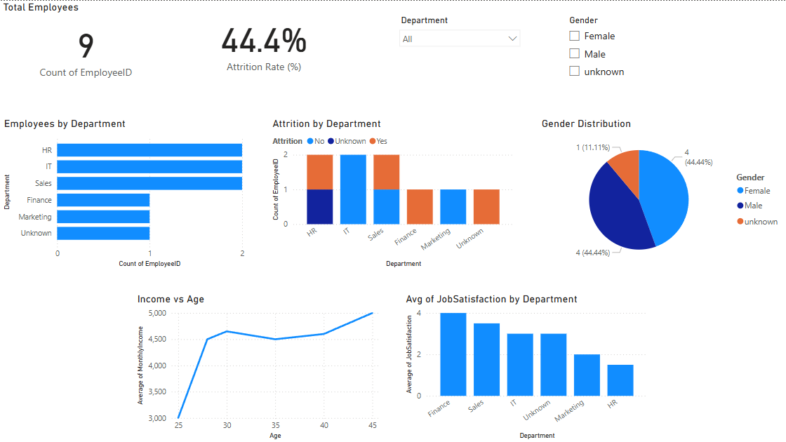

# HR Attrition Power BI Dashboard

This interactive Power BI dashboard analyzes employee attrition trends, satisfaction, and demographics. Built using a messy dataset that was cleaned and visualized to deliver meaningful HR insights.

## 🔍 Key Insights
- 📉 **Attrition Rate:** 44.4%
- 🧑‍💼 **Department Breakdown**
- 👥 **Gender Distribution**
- 💰 **Income vs Age**
- 😐 **Job Satisfaction by Department**

## 📊 Tools Used
- Power BI
- Power Query (Data Cleaning)
- DAX (KPI Measures)
- Custom Visuals & Slicers

## 📸 Screenshot

## 👤 Author
**Navaneeth Prem**  
[LinkedIn](www.linkedin.com/in/navaneeth-prem-66a154352) | [GitHub](https://github.com/navaneethprem)

